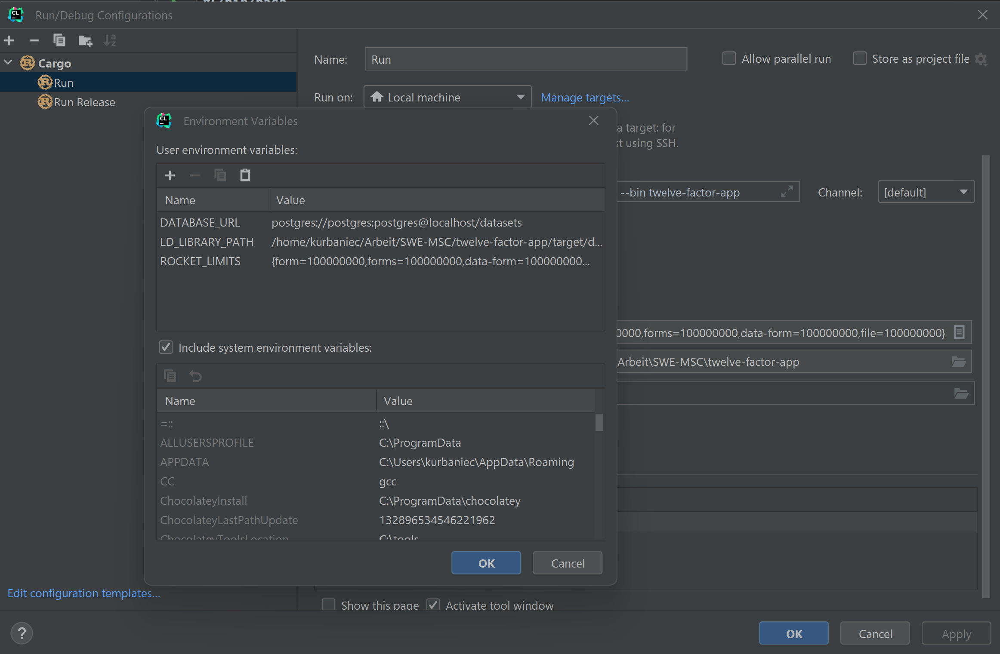

<div align="center">
  <p>Kacper Urbaniec | SWE | 28.10.2022</p>
  <h1><ins>Assignment 2: twelve-factor-app</ins></h1>
</div>
## Implemented Factors

### Codebase

> One codebase tracked in revision control, many deploys

The codebase and all related assets such as test scripts or the Dockerfile for containerisation are all part of the same project, which is tracked in Git at https://github.com/kurbaniec/swe-twelve-factor-app.

In terms of deploys, on the one hand there is the local development environment that I set up when I developed and tested the application. There is also an environment that mimics a production environment in a sense. When pushing on the `main` branch, a new Docker image is created and published to the GitHub container registry at https://github.com/kurbaniec/swe-twelve-factor-app/pkgs/container/dogorcat-service. 

If it were a real production application, one could simply add further steps to the [CI/CD pipeline of the project](https://github.com/kurbaniec/swe-twelve-factor-app/blob/main/.github/workflows/main.yml), e.g. deploy the created Docker image to the cloud to make it available to users. Also adding more environments like Staging would make sense in real-word application development.

### Dependencies

> Explicitly declare and isolate dependencies

The project explicitly declares dependencies in two files:  [`Cargo.toml`](https://github.com/kurbaniec/swe-twelve-factor-app/blob/main/Cargo.toml) & [`Dockerfile`](https://github.com/kurbaniec/swe-twelve-factor-app/blob/main/Dockerfile).

 `Cargo.toml` is the Rust equivalent of `package.json` from `NPM`. It specifies all dependencies that the package manager `cargo` installs & manages for the Rust application.

Rust binaries rely on static linking meaning that the compiled binary contains all dependencies in the executable. However, some libraries used in the project break with this convention, as they rely on external dependencies that have to be additionally installed & linked during execution.

Firstly, there is Tensorflow itself, where the Rust library is just a wrapper around the C-API and therefore the pre-built C-API has to be linked dynamically. The Diesel-ORM used for the project also requires `libpq-dev`, the C-API for PosgreSQL.

As we can see, `cargo` can manage most of the project's dependencies by explicitly declaring them, however these two outliers break the dependency principle of the twelve-factor app. This is where the Dockerfile comes in.

In the Dockerfile, the external dependencies are explicitly declared, nothing needs to be configured, the image created takes care of everything. Also, when using Docker images, we can be sure that no implicit dependencies are leaked, so all our dependencies are properly isolated.

### Config

> Store config in the environment

The web framework used [Rocket](https://rocket.rs/v0.5-rc/guide/configuration/) & ORM [Diesel](https://diesel.rs/guides/getting-started.html) both rely on environment variables to configure them. Therefore it was quite easy to follow the config principle.

For development, I conveniently set my environment variables in the IDE and changed it as needed to test different features.



When creating a container for the application, one can use the `-e` flag to specify environment variables to be used. For example, the `DATABASE_URL` might vary between deployments and is therefore a potential candidate for setting. One could also change the default settings for the Rocket web framework to change its behaviour for a deployment.

One thing I added when creating the Docker container are [some environment variables](https://github.com/kurbaniec/swe-twelve-factor-app/blob/main/entrypoint.sh) that are set when no external variables are passed via `-e` during container creation.

The reason for this is that some default settings of Rocket do not work very well with the project, for example file uploads are limited to 1MB, which is a bit problematic when an ordinary Tensorflow model is 50MB. 

For example, instead of passing `-v ROCKET_LIMITS={form=100000000,forms=100000000,data-form=100000000,file=100000000}` on every container creation to increase the upload limit, I added the following line which sets the environment variable to more appropriate upload limits if the variable is not already set. This means that these values are not hardcoded and can be easily updated without recreating the Docker image.

```bash
export ROCKET_LIMITS="${ROCKET_LIMITS:={form=100000000,forms=100000000,data-form=100000000,file=100000000}}"
```

### Backing Services

> Treat backing services as attached resources

The project uses only one backing service, a PostgreSQL database. The application uses the environment variable `DATABASE_URL` to read the URL of the database. Switching between databases in different deployments is quite simple: update the `DATABASE_URL` variable, create a new container and you are done. This way, one can use a PostgreSQL Docker container for development and a third-party managed container on a cloud service for production.

### Build, relas

## Acknowledgments

* https://12factor.net/
* https://www.redhat.com/architect/12-factor-app
* https://www.youtube.com/watch?v=REbM4BDeua0
