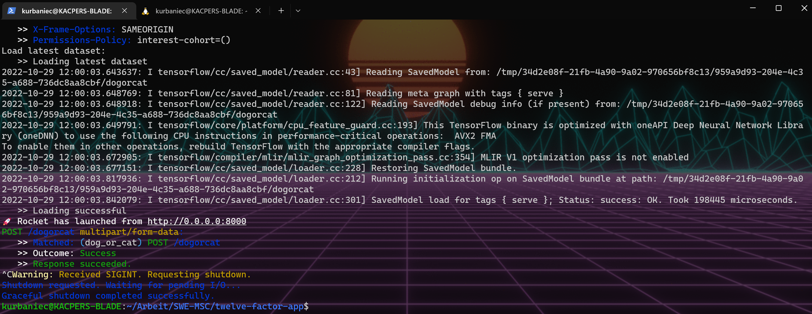

<div align="center">
  <p>Kacper Urbaniec | SWE | 28.10.2022</p>
  <h1><ins>Assignment 2: twelve-factor-app</ins></h1>
</div>

## Implemented Factors

### Codebase

> One codebase tracked in revision control, many deploys

The codebase and all related assets such as test scripts or the Dockerfile for containerisation are all part of the same project, which is tracked in Git at https://github.com/kurbaniec/swe-twelve-factor-app.

In terms of deploys, on the one hand there is the local development environment that I set up when I developed and tested the application. There is also an environment that mimics a production environment in a sense. When pushing on the `main` branch, a new Docker image is created and published to the GitHub container registry at https://github.com/kurbaniec/swe-twelve-factor-app/pkgs/container/dogorcat-service. 

If it were a real production application, one could simply add further steps to the [CI/CD pipeline of the project](https://github.com/kurbaniec/swe-twelve-factor-app/blob/main/.github/workflows/main.yml), e.g. deploy the created Docker image to the cloud to make it available to users. Also adding more environments like Staging would make sense in real-word application development.

### Dependencies

> Explicitly declare and isolate dependencies

The project explicitly declares dependencies in two files:  [`Cargo.toml`](https://github.com/kurbaniec/swe-twelve-factor-app/blob/main/Cargo.toml) & [`Dockerfile`](https://github.com/kurbaniec/swe-twelve-factor-app/blob/main/Dockerfile).

 `Cargo.toml` is the Rust equivalent of `package.json` from `NPM`. It specifies all dependencies that the package manager `cargo` installs & manages for the Rust application.

Rust binaries rely on static linking meaning that the compiled binary contains all dependencies in the executable. However, some libraries used in the project break with this convention, as they rely on external dependencies that have to be additionally installed & linked during execution.

Firstly, there is Tensorflow itself, where the Rust library is just a wrapper around the C-API and therefore the pre-built C-API has to be linked dynamically. The Diesel-ORM used for the project also requires `libpq-dev`, the C-API for PosgreSQL.

As we can see, `cargo` can manage most of the project's dependencies by explicitly declaring them, however these two outliers break the dependency principle of the twelve-factor app. This is where the Dockerfile comes in.

In the Dockerfile, the external dependencies are explicitly declared, nothing needs to be configured, the image created takes care of everything. Also, when using Docker images, we can be sure that no implicit dependencies are leaked, so all our dependencies are properly isolated.

### Config

> Store config in the environment

The web framework used [Rocket](https://rocket.rs/v0.5-rc/guide/configuration/) & ORM [Diesel](https://diesel.rs/guides/getting-started.html) both rely on environment variables to configure them. Therefore it was quite easy to follow the config principle.

For development, I conveniently set my environment variables in the IDE and changed it as needed to test different features.


When creating a container for the application, one can use the `-e` flag to specify environment variables to be used. For example, the `DATABASE_URL` might vary between deployments and is therefore a potential candidate for setting. One could also change the default settings for the Rocket web framework to change its behaviour for a deployment.

One thing I added when creating the Docker container are [some environment variables](https://github.com/kurbaniec/swe-twelve-factor-app/blob/main/entrypoint.sh) that are set when no external variables are passed via `-e` during container creation.

The reason for this is that some default settings of Rocket do not work very well with the project, for example file uploads are limited to 1MB, which is a bit problematic when an ordinary Tensorflow model is 50MB. 

For example, instead of passing `-v ROCKET_LIMITS={form=100000000,forms=100000000,data-form=100000000,file=100000000}` on every container creation to increase the upload limit, I added the following line which sets the environment variable to more appropriate upload limits if the variable is not already set. This means that these values are not hardcoded and can be easily updated without recreating the Docker image.

```bash
export ROCKET_LIMITS="${ROCKET_LIMITS:={form=100000000,forms=100000000,data-form=100000000,file=100000000}}"
```

### Backing Services

> Treat backing services as attached resources

The project uses only one backing service, a PostgreSQL database. The application uses the environment variable `DATABASE_URL` to read the URL of the database. Switching between databases in different deployments is quite simple: update the `DATABASE_URL` variable, create a new container and you are done. This way, one can use a PostgreSQL Docker container for development and a third-party managed container on a cloud service for production.

### Build, release, run

> Strictly separate build and run stages

This is one of the principles that I have not fully implemented, as the [CI/CD pipeline](https://github.com/kurbaniec/swe-twelve-factor-app/blob/main/.github/workflows/main.yml) for the project really only consists of the build stage. 

If it were a real production application, one would add a release & run stage to the pipeline. In the release stage, one or more containers would be build with environment variables for the target environment, e.g. production or staging. In the run stage, the built containers would be deployed to e.g. a cloud service provider for production or to an internal server for testing in staging.

### Processes

> Execute the app as one or more stateless processes

The app when containerised, can be seen as a stateless process that provides a `dogorcat` image classification service. The underlying web framework uses multiple threads when more than one request is sent to the app, but it is essentially just a stateless process. Each uploaded Tensorflow model is stored in a PostgresSQL service shared by all containers. Therefore, the app container is stateless, only the backing service is stateful.

### Port binding

> Export services via port binding

The application does not rely on the runtime injection of a web server. The web framework used by the app creates a web-based service that is mapped to port 8000 by default. So when creating a container, one can use `-p 8000:8000` to map the port 8000 of the container to port 8000 on the Docker host.

The load balancing example in the [README](./README.md) uses a different approach with Docker networks. Instead of binding multiple app service containers to the host, the containers are created in a Docker network. The configured haproxy load balancer, running on the same Docker network, maps the containers internally across the network by name and provides a port 8000 that balances all requests to the registered containers.

### Concurrency

> Scale out via the process model

This is in a sense a continuation of *Processes* & *Port Binding*. Each `dogorcat` service can be seen as a stateless worker process that can easily be scaled horizontally.

This means that one can improve performance and latency by starting multiple `dogorcat` services behind a load balancer that represents a web process. If more requests than usual come in, one can simply put up more containers to meet the demand.

At startup, all `dogorcat` services pull the latest Tensorflow model to use for image classification. Each service is independent and deterministic, which means that it makes no difference to the user on which service instance the image classification is performed, the result will be the same.  

When a new Tensorflow model is uploaded to a `dogorcat` service instance, one can either send a request to all remaining running containers to update their models or simply create new containers, as the latest Tensorflow model is automatically pulled from the backing service at startup.

### Disposability

> Maximize robustness with fast startup and graceful shutdown

Rust creates binaries that are native machine code and do not require a virtual machine or even garbage collection. This means that the start-up time is essentially zero. After the app is launched, it takes only a few seconds to load the latest Tensorflow model.

As far as graceful shutdown is concerned, this aspect was quite easy to achieve, as the used web framework Rocket supports this by default. When a SIGTERM signal is received, the web framework stops listening for new requests and waits until the pending requests are finished. Then it exists automatically.



However, this does not help if the machine on which the app is running suddenly fails because of a power failure or for other reasons. The data should still be consistent in such situations. Therefore, all CRUD operations that modify data are executed as transactions, so that a sudden power failure does not leave the data in an inconsistent state.

### Dev/prod parity

> Keep development, staging, and production as similar as possible

After adding a pipeline at the end of the project, it became quite easy and fast to create deployments, in the case of this project creating and publishing a Docker image. As this is an individual assignment, I am responsible for writing and deploying the application, so the personal gap is as small as possible.

The difference in tools is more interesting. The idea is to keep development and production as similar as possible. My personal computer runs Windows, but I developed and tested the application using [WSL2](https://learn.microsoft.com/en-us/windows/wsl/about), a lightweight Linux virtual machine that I run Ubuntu on. I used CLion as the IDE for this project, which has great integrations with WSL2, so I can run the IDE natively while the code is built and run in the subsystem. 

The Docker image for the application is also based on Debian (superset of Ubuntu) and the pipeline that creates and publishes the image also runs on Ubuntu. So essentially there are no technology differences between development and production. The database for testing in development and with the published Docker image was also a containerised PostgreSQL instance.

### Logs

> Treat logs as event streams

This was probably the easiest factor, by default Rust and the web framework used and even external dependencies like Tensorflow just write everything to `stdout`.

### Admin processes

> Run admin/management tasks as one-off processes

The app uses the ORM [Diesel](https://diesel.rs/guides/getting-started.html) as a migration tool and library within the app itself to perform CRUD operations. The migration tool is a separate binary outside the app called Diesel CLI, which can be called via `diesel`.

Each `dogorcat` service container comes not only with application code, but also with admin code, as the factor describes. In the case of the `dogorcat` service, this is the Diesel CLI & the corresponding migration folder.

If a container is built with the environment variable `-e RUN_MIGRATION=true`, the container will perform a non-destructive data migration at start-up (creating the required database tables if they do not already exist).  

```bash
if [ "$RUN_MIGRATION" = "true" ]
then
  echo "💾 Running Database Migration:"
  diesel migration run
  echo "   >> Migration successful"
fi
```

After that, the application binary is executed, one can upload Tensorflow models and perform image classifications. In short, containers with `RUN_MIGRATION=true` can be used to configure the database and upload an initial Tensorflow model. 

If one can be sure that the database is already configured, one can omit these admin/management tasks by not specifying the `RUN_MIGRATION` variable. However, if something goes wrong in production, one can use `ssh` or other remote command execution mechanisms to invoke the Diesel CLI manually, as each container has one.

## Acknowledgments

* https://12factor.net/
* https://www.redhat.com/architect/12-factor-app
* https://www.youtube.com/watch?v=REbM4BDeua0
